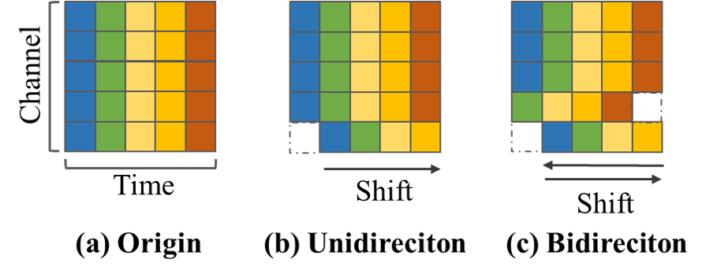

# Temporal Shift for Speech Emotion Recognition [[arXiv]](https://arxiv.org/abs/2302.13277)
Code for ICASSP 2023 paper "Mingling or Misalignment? Temporal Shift for Speech Emotion Recognition with Pre-trained Representations". 



## Libraries and Dependencies
 - [pytorch](https://github.com/pytorch/pytorch)
 - [torchaudio](https://github.com/pytorch/audio) (For pretrained wav2vec2 and HuBERT)
 - [transformers](https://huggingface.co) (For Specaugment)
 - [timm](https://github.com/huggingface/pytorch-image-models) (For optimizer and scheduler)
 - [yacs](https://github.com/rbgirshick/yacs) (For config)

## Data Preparation

Download our preprocessed [wavfeature_7.5.tar.gz](https://drive.google.com/file/d/1qmeyCw9Bq75Akewb0u6hrZFiwg_KDUtG/view?usp=share_link) directly and unzip it to `/dataset/IEMOCAP` directory.

Or obtain [IEMOCAP](https://sail.usc.edu/iemocap/) from USC and run

```
cd dataset/IEMOCAP
python Preprocess.py --path $path to directory of IEMOCAP$
cd ../..
```

Then you have `wavfeature_7.5.pkl` and each processed audio is clipped to 7.5s and samped at 16kHz.

## Training

We train the model specified in our paper with the same placement/proportion of shift. It should be noted that the placement/proportion of shift and other hyperparameters (see [config.py](config.py)) can be adjusted flexibly.

Key arguments for easy config modification in `main.py` are as follows,

* `--model`: the model chosen for training.
  * `cnn`: convnext-like 1D CNN with 2 blocks.
  * `rnn`: 1 layer bidirectioanl LSTM.
  * `transformer`: 2-block Transformer with relative positional embedding by default.
* `--shift`: whether to use temporal shift. The placement of shift are hard-coding as described in our paper: residual shift for CNN, replacement of MHSA for Transformer and in-place shift for lstm. We provide optional placement in annotation.
* `--ndiv`: proportion of shift, namely 1/ndiv of channels will be shifted while others reamain unchanged.
* `--stride`: the step to be shifted, kept as 1 by default.
* `--bidirectional`: whether to use bidirectional temporal shift.
* `--finetune`: whether to finetune the pretrained model or take the pretrained model as feature extractor. By default, we use wav2vec2 for finetuning and HuBERT for feature extraction.

For CNN and ShiftCNN

```bash
# Feture extraction for basic convnext
python main.py --model cnn
# Finetuning for basic convnext
python main.py --model cnn --finetune
# Feture extraction for ShiftCNN
python main.py --model cnn --shift --ndiv 16
# Finetuning for ShiftCNN
python main.py --model cnn --shift --ndiv 16 --finetune
```

For Transformer and Shiftformer

```bash
# Feture extraction for transformer
python main.py --model transformer
# Finetuning for transformer
python main.py --model transformer --finetune
# Feture extraction for Shiftformer
python main.py --model transformer --shift --ndiv 4 --bidirectional
# Finetuning for Shiftformer
python main.py --model transformer --shift --ndiv 4 --bidirectional --finetune
```

For LSTM and ShiftLSTM

```bash
# Feture extraction for lstm
python main.py --model rnn
# Finetuning for lstm
python main.py --model rnn --finetune
# Feture extraction for Shiftlstm
python main.py --model rnn --shift --ndiv 4
# Finetuning for Shiftlstm
python main.py --model rnn --shift --ndiv 4 --finetune
```

The fianl results of 5 fold is expected to be in `/log`.

## Citation
```bibtex
@inproceedings{shen2023mingling,
  title={Mingling or misalignment? temporal shift for speech emotion recognition with pre-trained representations},
  author={Shen, Siyuan and Liu, Feng and Zhou, Aimin},
  booktitle={ICASSP 2023-2023 IEEE International Conference on Acoustics, Speech and Signal Processing (ICASSP)},
  pages={1--5},
  year={2023},
  organization={IEEE}
}
```
